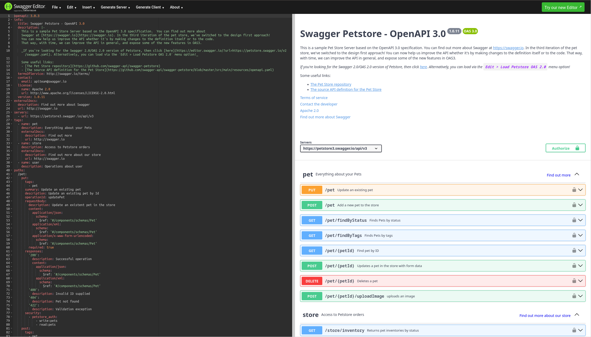

# OpenAPI Basics

## OpenApi: About

- API description language on top of JSON schema 
- intended for REST and JSON RPC APIs with `JSON` or `XML` payloads
- language independent API specification written in `JSON` or `YML`
- plenty of generators and tools for individual language bindings
- client and server stubs generation for models and api

## OpenApi: Building Blocks

- General info block (title, license, server, tags, ...)
- Operations (HTTP-verb + Path, request and responses, media-types)
- Schemata (named and anonymous models, parameters)
- Security (OAuth 2.0, HTTP BasicAuth, ...)

## OpenApi: Swagger Editor

{ height=70% }

## A1: Modelliere in OpenAPI

{ height=70% }

# Property-Based-Testing Basics

## PBT: General

![Testing Dilemma: "testing can  only find  bugs, not  prove  their absence" (E.W. Dijkstra in [-@bib:godefroid:model-checking]).](PBT-cartoon.png){ height=70% }

## PBT: Basics

$$ \forall s \in S: P(s) = \top, \qquad P: S \to \{ \top, \bot \} $$ {#eq:pbt-basics}

- $S$: state space of valid instances
- $P$: property to prove, candidates involve [-@bib:pbt:patterns]:
  - invariants,
  - round-trips,
  - symmetry,
  - commutativity,
  - idem-potency, and 
  - induction

## A2: Implementiere PBT `isValid()`

- let `jqwik` generate arbitraries
- validate any arbitraries with `openapi4j` 
- use model `Route` from previous exercise

# Applying PBT to OpenAPI /-Generator

## Folie 3
## A3: Modelliere in OpenApi und prüfe mit PBT

{ height=70% }

{ height=70% }

# Questions?

## References