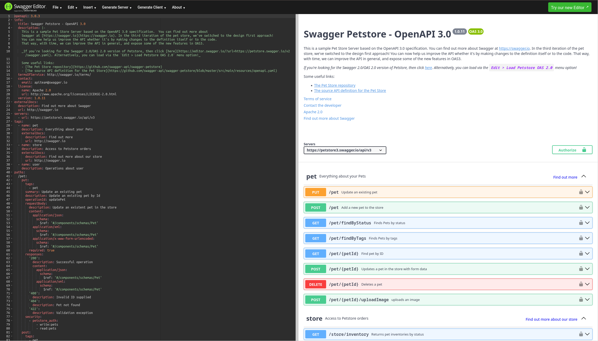
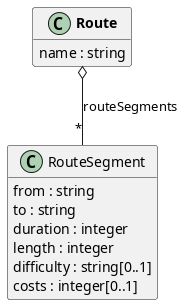

# OpenAPI Basics

## OpenApi: About

- API description language on top of JSON schema 
- intended for REST and JSON RPC APIs with `JSON` or `XML` payloads
- language independent API specification written in `JSON` or `YML`
- plenty of generators and tools for individual language bindings
- client and server stubs generation for models and api

## OpenApi: Building Blocks

- General info block (title, license, server, tags, ...)
- Operations (HTTP-verb + Path, request and responses, media-types)
- Schemata (named and anonymous models, parameters)
- Security (OAuth 2.0, HTTP BasicAuth, ...)

## OpenApi: Swagger Editor

{ height=70% }

## A1: Modelliere in OpenAPI

{ height=70% }

# Property-Based-Testing Basics

## PBT: Basics

$$ \exists P: S \to \{ \top, \bot \} \implies P(s) = \top, \forall s \in S $$ {#eq:pbt-basics}

# Applying PBT to OpenAPI /-Generator

## Folie 3
