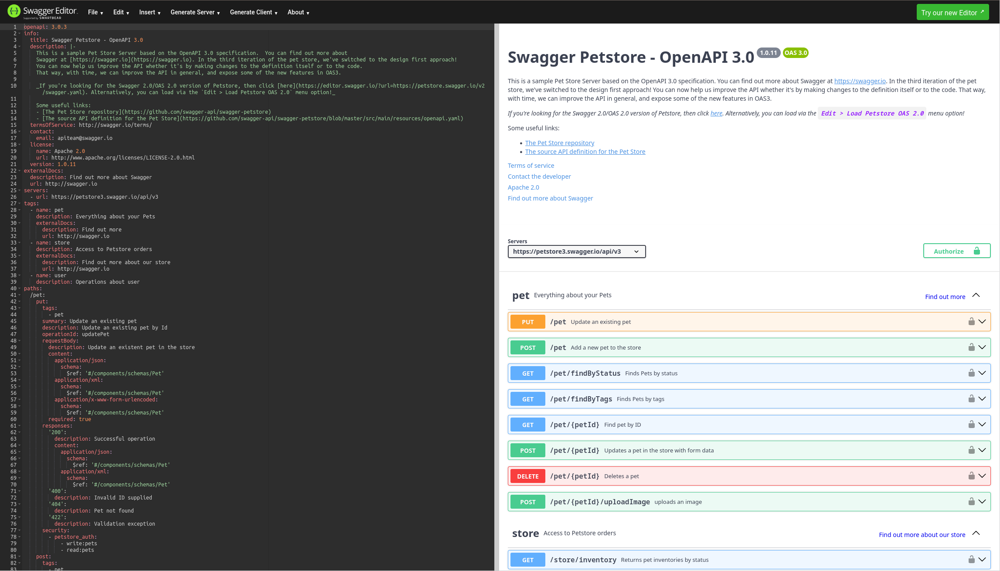

# OpenAPI Basics

## OpenApi: About

- API description language on top of JSON schema 
- intended for REST and JSON RPC APIs with `JSON` or `XML` payloads
- language independent API specification written in `JSON` or `YML`
- plenty of generators and tools for individual language bindings
- client and server adapter generation for models and api

## OpenApi: Building Blocks

- General info block (title, license, info, server, tags, ...)
- Operations (HTTP-verb + Path, request and responses, media-types)
- Schemata (named and anonymous models, parameters)
- Security (OAuth 2.0, HTTP BasicAuth, ...)

## OpenApi: Swagger Editor

[{ height=70% }](https://editor.swagger.io/)

## Vorbereitung

ERNICommunity GitHub Projekt auschecken: https://github.com/ERNICommunity/openapi-workshop

## A1: Modelliere in OpenAPI

{ height=70% }

## A1: Ausgangslage

{ height=70% }

## A1: 4 "Route"-Attribute hinzufügen

- duration: integer
- length: integer
- difficulty: string[0..1]
- cost: [0..1]

## 

# Property-Based-Testing Basics

## PBT: General

![Testing Dilemma: "testing can  only find  bugs, not  prove  their absence" (E.W. Dijkstra in [-@bib:godefroid:model-checking]).](PBT-cartoon.png){ height=70% }

## PBT: Basics

$$ \forall i \in A: P(i) = \top, \qquad P: A \to \{ \top, \bot \} $$ {#eq:pbt-basics}

- $A$: domain of valid input values ("Eingabedomäne")
- $P$: property to prove; candidates include:
  - invariants
  - round-trips
  - symmetry
  - commutativity
  - idempotency
  - induction

[-@bib:pbt:patterns]

## A2: Implementiere PBT `isValid()`

- using the Arbitraries class, write a `jqwik` "@Provider" 
  function to define an "Arbitrary" that generates input data ("Testdatengenerator")
- validate all inputs with `openapi4j`
- use model `Route` from previous exercise

# Applying PBT to OpenAPI /-Generator

## A3: Modelliere in OpenApi und prüfe mit PBT

{ height=70% }

{ height=70% }

# Questions?

## References
